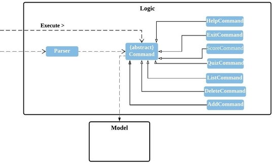

# Developer Guide

## Design & Implementation
1. Architecture
The Duke class is the main class of the product.It is responsible for,

	At app launch: Initializes the components in the correct sequence, and connects them up with each other.

	At shut down: Shuts down the components and invokes storage method where necessary.	

The product also contains the following components as well:
cards: Holds the data in the type of Card and relative operations
subjects: Holds the data in the type of Subject and relative operations
score: Holds the data in the type of Score and relative operations
commands: Deals with user input and communicate CLI to relative methods
exceptions: Deals with illegal inputs
parser: Convert CLI inputs into command keywords

In these components, cards and subjects have similar structure. Both of them contains a Card/Subject class and CardList/SubjectList class.
Duke, along with all command class and Parser form the logic box of the product
 

 Logic box interacts with data box, ie Card, CardList, Subject, SubjectList, ScoreList.
 

 Finally the storage box, ie Storage class will handle writing and reading the files.
 {insert image here}

## Product Scope
### Target user profile
The product is intended for students preparing for exams. Students can store practice question and model answers in the product.
Also, the product offers students to quiz themselves to practice for exams

### Value proposition
The product aims to provide students with more convient way of doing revision. By using the product students can categorize questions into different subjects and practice more effectively.

## User Stories

|Version| As a ... | I want to ... | So that I can ...|
|--------|----------|---------------|------------------|
|v1.0|user|add new cards|view cards and answers to revise|
|v1.0|user|delete cards|organize cards better|
|v1.0|user|quiz myself|practice the questions|
|v1.0|user|list cards|organize the cards|
|v2.0|user|add cards with subjects|categorize the cards better|
|v2.0|user|list cards by subjects|organize the cards|
|v2.0|user|delete subjects|organize subjects better|
|v2.0|user|view my score|see how I performed|
|v2.0|user|view my test history|see how I performed|

## Non-Functional Requirements
 1.The product should be able to run on any platform that has JDK11
 2.The product should be able to hold up to 1000 cards

## Glossary

* *glossary item* - Definition

## Instructions for Manual Testing
 1. Running Tests
 There are two ways to run tests.

 Method 1: Using IntelliJ JUnit test runner

 To run all tests, right-click on the src/test/java folder and choose Run 'All Tests'

 Method 2: Using Gradle

 Open a console and run the command gradlew clean test (Mac/Linux: ./gradlew clean test)

 See UsingGradle.adoc for more info on how to run tests using Gradle.

 2. Types of tests
 We have three types of tests:

 Unit tests targeting the lowest level methods/classes.
 e.g. seedu.cards.CardTest

 Integration tests that are checking the integration of multiple code units (those code units are assumed to be working).
 e.g. seedu.cards.CardListTest
