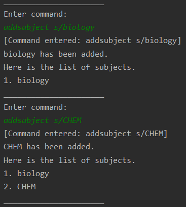
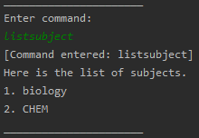
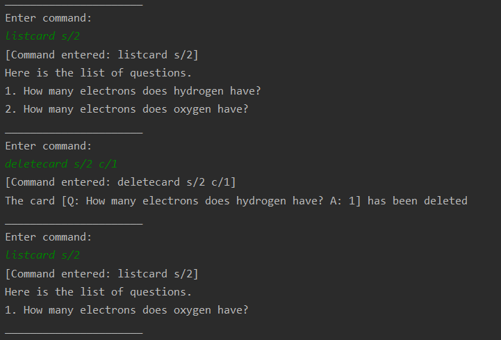
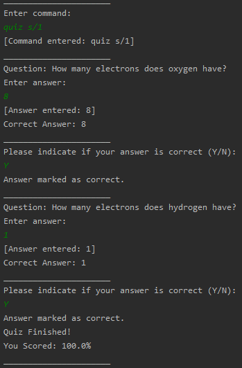
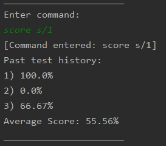

# User Guide

## Introduction
The Exam Study Companion (ESC) is for students who want to improve on their grades by quizzing themselves through flashcards. ESC is a command line (CLI) program, with a simple, no frills user interface that is quick and easy to use.

ESC is a flashcard study program, where you are able to create cards and categorise them, and you can also quiz yourself using your flashcards.

ESC is meant to help students be able to study more effectively using the medium that they prefer, providing a simple, easy to use interface for the timestrapped student who prefers using CLI based applications and are able to type quickly. 

## Quick Start
1. Ensure that you have Java 11 or above installed on your computer.
2. Download the latest version of `ESC` from [here](http://link.to/duke).
3. Run ESC on your command terminal using this command: `java -jar <directory>/duke.jar`

## Quick Use
1. Create a subject.
    * `addsubject s/<name>`
2. Create cards to add to your subject. 
    * `addcard s/<index> q/<question> a/<answer>`
3. Start a quiz to test yourself.
    * `quiz s/<index>`
    
A more detailed explanation of the features are covered in the following sections. 

## Features 
### Creating a Subject: `addsubject`
Creates a subject for categorisation of cards.

Format: `addsubject s/<SUBJECTNAME>`

* The `SUBJECTNAME` can be in a natural language format.

Example of usage: 
* `addsubject s/biology`
* `addsubject s/CHEM`

Screenshot showing addsubject:

### Listing all Subjects
Lists all the current subjects.

Format & Usage: `listsubject`

Screenshot showing listsubject:

### Deleting a Subject
Deletes the specified subject AND all the cards in the subject.

Format: `deletesubject s/<INDEX>`

* The `INDEX` is based on the index of the subject. This can be found using the `listsubject` command.

Example of usage:
* `deletesubject s/1`
* `deletesubject s/4`

Screenshot showing deletesubject:

### Creating a Card
Creates a card and adds it to the specified subject.

Format: `addcard s/<INDEX> q/<QUESTION> a/<ANSWER>`
* The `INDEX` is based on the index of the subject. This can be found using the `listsubject` command.

Example of Usage:
* `addcard s/2 q/What year was NUS established? a/1980`
* `addcard s/1 q/How many electrons does oxygen have? a/8`

### Listing Cards in a Subject
Lists all the cards in the specified subject.

Format: `listcard s/<INDEX>`
* The `INDEX` is based on the index of the subject. This can be found using the `listsubject` command.

Example of Usage:
* `listcard s/1`
* `listcard s/2`

Screenshot showing listcard:

### Deleting a Card
Deletes the specified card from the specified category 

Format: `deletecard s/<S-INDEX> c/<C-INDEX>`
* The `S-INDEX` is based on the index of the subject. This can be found using the `listsubject` command.
* The `C-INDEX` is based on the index of the card. This can be found using the `listcard s/<S-INDEX>` command.

Example of Usage:
* `deletecard s/2 c/1`
* `deletecard s/5 c/17`

Screenshot showing deletecard:

### Starting a Quiz
Starts a quiz of the specified number of questions from the specified subject.

Format: `quiz s/<INDEX> n/<NUMBER>`
* The `INDEX` is based on the index of the subject. This can be found using the `listsubject` command.
* The `NUMBER` is the number of questions the user wishes to be quizzed on.

Example of Usage:
* `quiz s/2 n/15`
* `quiz s/1 n/5`

Screenshot showing quiz:

### Viewing Past Scores
Shows the previous scores of quizzes from the specified subject 

Format: `score s/<INDEX>`
* The `INDEX` is based on the index of the subject. This can be found using the `listsubject` command.

Example of Usage:
* `score s/1`
* `score s/2`

Screenshot showing score:

### Displaying the Help Page
Displays the list of available commands.

Format & Usage: `help`

Screenshot showing help:

### Exiting the Program
Closes the program 

Format & Usage: `exit` 

## FAQ
**Q**: Can I import question packs from other people?

**A**: At the current stage, no, but it is in the development list for if we continue with this in future!

**Q**: If I exit the program, will all my existing cards be saved?

**A**: Yes! All your subjects, cards and scores are saved. To ensure that your data is not lost, do not delete the folder called 'data' that is created when you first run the program.

## Command Summary
* Add a subject `addsubject s/<SUBJECTNAME>`
* List all subjects `listsubject`
* Delete a subject and all its cards `deletesubject s/<INDEX>`                    
* Add a card into the specified subject `addcard s/<INDEX> q/<QUESTION> a/<ANSWER>`
* List all cards in specified subject `listcard s/<INDEX>`
* Delete the specified card from the specified category `deletecard s/<INDEX> c/<INDEX>`
* Start a quiz from the specified subject `quiz s/<INDEX>`
* Get previous scores of quizzes from specified subject `score s/<INDEX>`
* Displays the help page `help`
* Exits the program `exit` 